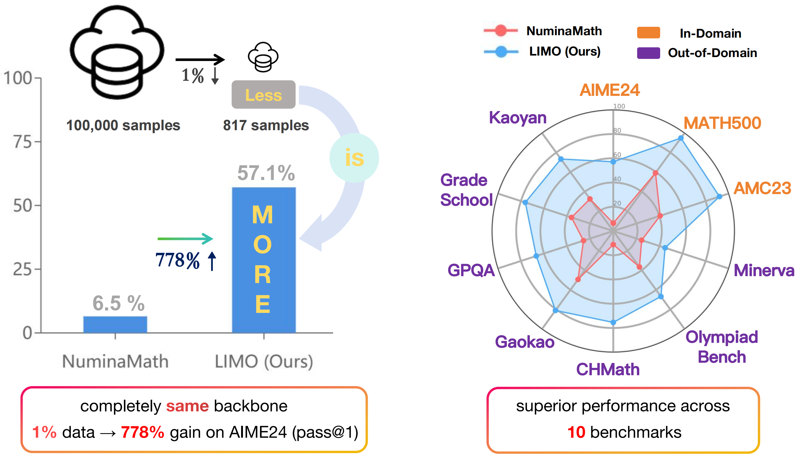

# LIMO: Less Is More for Reasoning 🚀

<p align="center">
  📄 <a href="https://arxiv.org/pdf/2502.03387" target="_blank">Paper</a> &nbsp; | &nbsp;
  🌐 <a href="https://huggingface.co/datasets/GAIR/LIMO" target="_blank">Dataset</a> &nbsp; | &nbsp;
  📘 <a href="https://huggingface.co/GAIR/LIMO" target="_blank">Model</a>
</p>


<p align="center">        </p>


## Updates
- [2025/02/18] 🚨 We've added LIMO's performance on the recently completed [AIME 2025 evaluation](https://github.com/GAIR-NLP/AIME-Preview), where it achieved a solid score of 44.6, demonstrating competitive performance using only 817 training samples compared to other models trained on much larger datasets (800k samples).
- [2025/02/10] 🚨 [Third-party evaluations](https://x.com/WenhuChen/status/1888691381054435690) highlight LIMO's strong generalization capabilities
- [2025/02/08] 🚨 The LIMO dataset has received positive recognition from the [community](https://x.com/stefan_fee/status/1888203185937907993). According to third-party evaluations, the dataset achieved a 10-percentage point performance improvement on AIME24 and GPQA benchmarks, and a 3-point improvement on MATH-500. These experimental results demonstrate LIMO's potential in enhancing RL Scaling.


## 📌 Table of Contents
- [LIMO: Less Is More for Reasoning 🚀](#limo-less-is-more-for-reasoning-)
  - [Updates](#updates)
  - [📌 Table of Contents](#-table-of-contents)
  - [Overview](#overview)
  - [Key Results](#key-results)
    - [New Results on AIME 2025](#new-results-on-aime-2025)
  - [Model Zoo](#model-zoo)
  - [Datasets](#datasets)
  - [Quick Start](#quick-start)
  - [Training](#training)
    - [Training Setup](#training-setup)
    - [Launch Training](#launch-training)
  - [Evaluation](#evaluation)
  - [License](#license)
  - [Citation](#citation)


## Overview

LIMO challenges the conventional wisdom in mathematical reasoning by demonstrating that models can achieve superior performance with significantly less but higher quality training data. Our approach:

- 🎯 Achieves SOTA with only 817 carefully curated training samples
- 🌟 Shows strong generalization across diverse problem types
- 🔬 Provides comprehensive evaluation on 10 benchmarks
- 📚 Releases high-quality datasets and evaluation tools

## Key Results

### New Results on AIME 2025
| Model                         | Samples | AIME 2024 | AIME I 2025 (AVG) |
| ----------------------------- | ------- | --------- | ----------------- |
| o3-mini-high                  | N/A     | 83.8      | 76.7              |
| o3-mini-medium                | N/A     | 75.8      | 66.7              |
| DeepSeek-R1                   | N/A     | 79.8      | 65.0              |
| DeepSeek-R1-Distill-Llama-70B | 800k    | 57.1      | 51.4              |
| o1-mini                       | N/A     | 63.6      | 50.8              |
| DeepSeek-R1-Distill-Qwen-14B  | 800k    | 61.7      | 46.7              |
| DeepSeek-R1-Distill-Qwen-32B  | 800k    | 58.3      | 46.1              |
| **LIMO**                      | 817     | 56.3      | 44.5              |
| o3-mini-low                   | N/A     | 56.3      | 44.2              |
| gemini-2.0-flash-thinking     | N/A     | 61.5      | 43.3              |
| o1-preview                    | N/A     | 44.6      | 37.5              |
| QwQ                           | N/A     | 46.7      | 37.2              |
| DeepSeek-R1-Distill-Qwen-7B   | 800k    | 49.6      | 36.9              |
| s1                            | 1k      | 32.9      | 28.9              |
| DeepSeek-R1-Distill-Qwen-1.5B | 800k    | 25.0      | 28.0              |
| DeepSeek-R1-Distill-Llama-8B  | 800k    | 37.1      | 24.7              |


| Model         | AIME24    | MATH500   | Training Samples |
| ------------- | --------- | --------- | ---------------- |
| LIMO (Ours)   | **57.1%** | **94.8%** | 817              |
| Previous SOTA | 6.5%      | 59.2%     | 100k+            |

<details>
<summary>Click to see more detailed results</summary>

| Benchmark     | LIMO      | Previous SOTA | Improvement |
| ------------- | --------- | ------------- | ----------- |
| AIME24        | **57.1%** | 6.5%          | +50.6%      |
| MATH500       | **94.8%** | 59.2%         | +35.6%      |
| AMC23         | **92.0%** | 40.6%         | +51.4%      |
| OlympiadBench | **66.8%** | 36.7%         | +30.1%      |
| CHMath        | **75.4%** | 11.2%         | +64.2%      |
| Gaokao        | **81.0%** | 49.4%         | +31.6%      |
| Kaoyan        | **73.4%** | 32.7%         | +40.7%      |
| GradeSchool   | **76.2%** | 36.2%         | +40.0%      |
| Minerva       | 44.9%     | **47.1%**     | -2.2%       |
| GPQA          | 66.7%     | **73.3%**     | -6.6%       |

</details>

## Model Zoo

Our LIMO model is available on Hugging Face 🤗:

| Model | Backbone                                                                 | Size | Link                                  |
| ----- | ------------------------------------------------------------------------ | ---- | ------------------------------------- |
| LIMO  | [Qwen2.5-32B-Instruct](https://huggingface.co/Qwen/Qwen2.5-32B-Instruct) | 32B  | [🤗](https://huggingface.co/GAIR/LIMO) |


## Datasets

We release our datasets through Hugging Face 🤗:

| Dataset | Description                           | Size | Link                                           |
| ------- | ------------------------------------- | ---- | ---------------------------------------------- |
| LIMO    | Training set used to train LIMO model | 817  | [🤗](https://huggingface.co/datasets/GAIR/LIMO) |

Note: We are gradually releasing additional datasets mentioned in our paper, including those used for comparative experiments, to facilitate reproducibility and further analysis by the research community. Stay tuned!

## Quick Start

Our model is fine-tuned on [Qwen2.5-32B-Instruct](https://huggingface.co/Qwen/Qwen2.5-32B-Instruct) and is compatible with most mainstream frameworks like [HF Transformers](https://github.com/huggingface/transformers), [VLLM](https://github.com/vllm-project/vllm), [TensorRT-LLM](https://github.com/NVIDIA/TensorRT-LLM) and etc. 


<details>
<summary>Start with HF Transformers</summary>

```bash
# Install required packages
pip install transformers
```

```python
from transformers import AutoModelForCausalLM, AutoTokenizer
import torch

# Initialize model and tokenizer
model = AutoModelForCausalLM.from_pretrained(
    "GAIR/LIMO",
    torch_dtype="auto",
    trust_remote_code=True,
    device_map="auto"
)
tokenizer = AutoTokenizer.from_pretrained("GAIR/LIMO", trust_remote_code=True)

# Prepare input messages (We use the following template and system prompt during training and inference)
messages = [
    {"role": "system", "content": "Please reason step by step, and put your final answer within \\boxed{}."},
    {"role": "user", "content": "What is the result of 1+1?"}
]

# Format input using chat template
text = tokenizer.apply_chat_template(
    messages,
    tokenize=False,
    add_generation_prompt=True
)

# Tokenize input
inputs = tokenizer(text, return_tensors="pt").to(model.device)

# Generate response
outputs = model.generate(
    **inputs,
    max_new_tokens=32768,
    temperature=0.7,
    top_p=0.95,
    do_sample=True
)

# Decode and print response
response = tokenizer.decode(outputs[0][inputs['input_ids'].shape[1]:], skip_special_tokens=True)
print(response)
```

</details>

<details>
<summary>Start with VLLM</summary>

```bash
# Install required packages
pip install vllm
```


```python
from vllm import LLM, SamplingParams
from transformers import AutoTokenizer

# Initialize the model
llm = LLM(
    model="GAIR/LIMO",
    tensor_parallel_size=4,  # adjust based on available GPUs
    trust_remote_code=True,
    swap_space=60,
    gpu_memory_utilization=0.96,
)

# Prepare input messages (We use the following template and system prompt during training and inference)
messages = [
    {"role": "system", "content": "Please reason step by step, and put your final answer within \\boxed{}."},
    {"role": "user", "content": "What is the result of 1+1?"}
]

# Setup tokenizer
tokenizer = AutoTokenizer.from_pretrained("GAIR/LIMO", trust_remote_code=True)
text = tokenizer.apply_chat_template(
    messages,
    tokenize=False,
    add_generation_prompt=True
)

# Configure generation parameters
sampling_params = SamplingParams(
    temperature=0.7,
    max_tokens=32768,
    top_p=0.95,
)

# Generate response
output = llm.generate(text, sampling_params)
print(output[0].outputs[0].text)
```

</details>


## Training

We utilize [LLaMA-Factory](https://github.com/hiyouga/LLaMA-Factory) framework for training, which provides a convenient and efficient training pipeline.

### Training Setup

1. **Environment Setup**
   - Set up LLaMA-Factory following their official [documentation](https://github.com/hiyouga/LLaMA-Factory#installation).
   - Ensure all dependencies are properly installed and configured.

2. **Data Preparation**
   - Obtain the LIMO dataset from [🤗 Hugging Face](https://huggingface.co/datasets/GAIR/LIMO).
   - Format the dataset according to LLaMA-Factory's [data preparation guidelines](https://github.com/hiyouga/LLaMA-Factory/tree/main/data). We also convert LIMO dataset to [the supported format](https://github.com/GAIR-NLP/LIMO/blob/main/train/data/limo.json).

3. **Configuration**
   - Use our provided [configuration file](https://github.com/GAIR-NLP/LIMO/blob/main/train/examples/train_limo.yaml).
   - The config file contains all necessary hyperparameters and training settings.

### Launch Training

For multi-node training, use the following command:

```bash
FORCE_TORCHRUN=1 \
NNODES=${PET_NNODES} \
NODE_RANK=${PET_NODE_RANK} \
MASTER_ADDR=${MASTER_ADDR} \
MASTER_PORT=${MASTER_PORT} \
llamafactory-cli train <path to yaml config file>
```

Where:
- `PET_NNODES`: Total number of nodes
- `PET_NODE_RANK`: Rank of current node (0-based)
- `MASTER_ADDR`: Address of master node
- `MASTER_PORT`: Port for communication
- `<path to yaml config file>`: Path to your training configuration YAML

For more detailed training examples and configurations, refer to [LLaMA-Factory's official training examples](https://github.com/hiyouga/LLaMA-Factory/blob/main/examples/README.md).

> **Note**: Multi-node training environments can vary significantly between different machines and cluster setups. You'll need to adapt the training configuration and launch commands according to your specific environment and infrastructure.


## Evaluation

We also release scripts for evaluating Large Language Models (LLMs) on mathematical reasoning tasks. The evaluation framework includes both inference (using the VLLM framework) and evaluation (using both rule-based and model-based approaches) components.

For rule-based evaluation, we support pure numerical problems like AIME and most MATH problems. For more complex responses (expressions, equations, or natural language descriptions), we employ model-based evaluation using Qwen2.5-32B-Instruct as the judge model.

For detailed instructions and implementation details, please refer to [`eval/README.md`](./eval/readme.md).


## License

This project is licensed under the MIT License - see the [LICENSE](LICENSE) file for details.


## Citation

```bibtex
@misc{ye2025limoreasoning,
      title={LIMO: Less is More for Reasoning}, 
      author={Yixin Ye and Zhen Huang and Yang Xiao and Ethan Chern and Shijie Xia and Pengfei Liu},
      year={2025},
      eprint={2502.03387},
      archivePrefix={arXiv},
      primaryClass={cs.CL},
      url={https://arxiv.org/abs/2502.03387}, 
}
```
